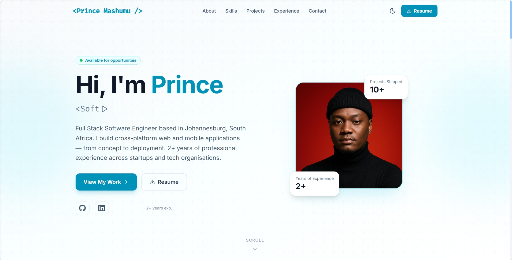

# Prince Mashumu � Portfolio

Personal portfolio website for **Prince Ngwako Mashumu**, Full Stack Software Engineer based in Johannesburg, South Africa.

🌐 **Live Site:** [your-deployed-url]



---

## Tech Stack

| Layer | Technology |
|---|---|
| Framework | React 18 + Vite |
| Styling | Tailwind CSS v4 |
| Animations | Framer Motion |
| Routing | React Router DOM v6 |
| SEO | React Helmet Async |
| Email | EmailJS |
| Icons | Lucide React |
| Fonts | Inter + Fira Code (Google Fonts) |

---

## Features

- **Splash screen** with animated logo and progress bar
- **Dark / Light mode** toggle persisted to localStorage
- **Typing effect** hero with animated skill titles
- **Live GitHub repos** � Projects section pulls directly from GitHub API
- **Animated skill bars** triggered on scroll
- **Vertical experience timeline** with career history
- **Working contact form** via EmailJS
- **Resume link** to OneDrive PDF
- **Fully responsive** � mobile, tablet, desktop
- **SEO optimised** � Open Graph + Twitter Card meta tags

---

## Project Structure

```
src/
+-- components/
�   +-- BrandIcons.jsx       # Custom SVG brand icons
�   +-- DarkModeToggle.jsx   # Moon/Sun toggle
�   +-- Footer.jsx
�   +-- Navbar.jsx
�   +-- SectionWrapper.jsx   # Reusable animated section wrapper
�   +-- SplashScreen.jsx     # Intro loader
+-- data/
�   +-- education.js
�   +-- experience.js
�   +-- skills.js
+-- hooks/
�   +-- useGitHubStats.js    # Fetches GitHub profile + repos
�   +-- useIntersectionObserver.js
+-- pages/
�   +-- BlogPost.jsx
�   +-- Home.jsx
+-- sections/
    +-- About.jsx
    +-- Contact.jsx
    +-- Experience.jsx
    +-- Hero.jsx
    +-- Projects.jsx         # Live GitHub repos grid
    +-- Skills.jsx
public/
+-- favicon.svg              # PM monogram favicon
+-- profile.jpeg             # Profile photo
```

---

## Getting Started

```bash
# Install dependencies
npm install

# Start development server
npm run dev

# Build for production
npm run build

# Preview production build
npm run preview
```

---

## Environment / Config

No `.env` file required. The following values are hardcoded in their respective files:

| Value | File |
|---|---|
| EmailJS Service ID | `src/sections/Contact.jsx` |
| EmailJS Template ID | `src/sections/Contact.jsx` |
| EmailJS Public Key | `src/sections/Contact.jsx` |
| GitHub Username | `src/sections/Projects.jsx` |

---

## Deployment

Build output is in `dist/`. Deploy to any static host:

- **Netlify** � drag & drop the `dist/` folder or connect the repo
- **Vercel** � import the repo, framework preset: Vite
- **GitHub Pages** � push `dist/` to the `gh-pages` branch

> After deploying, add your production domain to **EmailJS ? Account ? Security ? Allowed Origins**.

---

## Contact

- **Email:** princengwakomashumu@gmail.com
- **GitHub:** [github.com/Princemashumu](https://github.com/Princemashumu)
- **LinkedIn:** [linkedin.com/in/prince-ngwako-mashumu-77977924b](https://www.linkedin.com/in/prince-ngwako-mashumu-77977924b)
